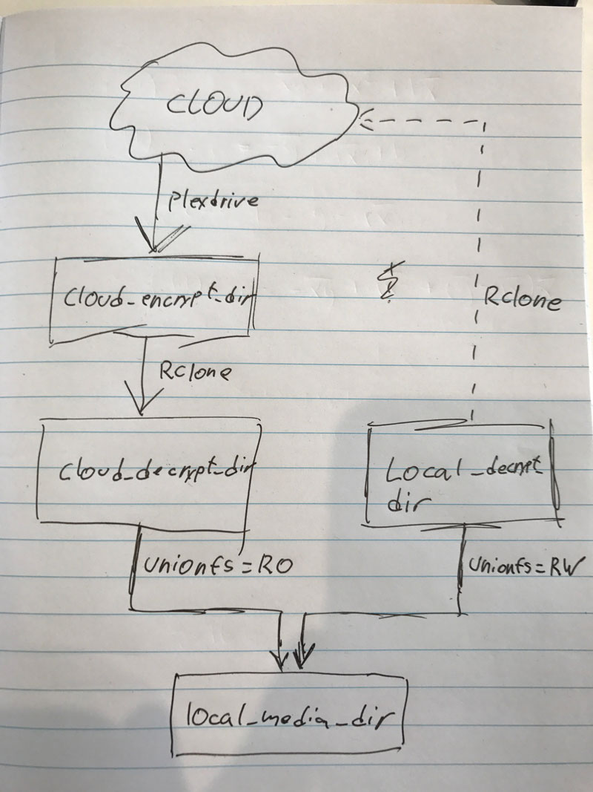

These scripts are created to have your media synced between your cloud- and local store. All media is always encrypted before being uploaded.
This also means if you loose your encryption keys you can't read your media.

**Plexdrive version 4.0.0 and Rclone version 1.36 is used.** 

There is a setup file, `setup.sh`, to install the necessary stuff automatically. This has only been tested on Ubuntu 16.04+.

# Getting started
1. Change `config` to match your settings.
2. Change configuration in each file to point to config.
3. Run `sudo sh setup.sh` and follow the instructions*.
4. Run `./mount.remote` to mount plexdrive and decrypt by using rclone.

To unmount run `./umount.remote`

*If this doesn't work, follow the manual setup instructions [here](#manually).

## Setup

### Rclone setup
Most of the configuration to set up is done through Rclone. Read their documentation [here](https://rclone.org/docs/).

3 configurations are needed to:
 - Connect to cloud.
 - Crypt for cloud.
 - Crypt for local.

This is done through the rclone config command.

View my example for an rclone configuration [here](rclone/rclone.template.conf).

_Good idea to backup your Rclone configuration and Plexdrive configuration and cache for easier setup next time._

### Manually
To install the necessary stuff manually do the following:
1. Install unionfs-fuse.
2. Install bc.
3. Install GNU screen.
4. Install [Rclone 1.36](https://downloads.rclone.org/rclone-current-linux-amd64.zip).
5. Install [Plexdrive 4.0.0](https://github.com/dweidenfeld/plexdrive/releases/download/4.0.0/plexdrive-linux-amd64).
6. Create the folders pointing, in the config file, to `local_decrypt_dir` and `plexdrive_temp_dir`.
7. Run rclone bin, installed in step 4, with the parameter `--config=RCLONE_CFG config` where `RCLONE_CFG` is the variable set in the config file.
8. Set up Google Drive remote, Crypt for Google Drive remove (rclone_cloud_endpoint) and crypt for local directory (rclone_local_endpoint).
9. Run plexdrive bin, installed in step 5, with the parameters `--config=PLEXDRIVE_DIR --mongo-database=MONGO_DATABASE --mongo-host=MONGO_HOST --mongo-user=MONGO_USER --mongo-password=MONGO_PASSWORD`. Remember to match the parameters with the variables in the config file.
10. Enter authorization to your Google Drive.
11. Cancel Plexdrive by pressing CTRL+C.
Run PlexDrive with GNU screen: `screen -dmS plexdrive PLEXDRIVE_BIN --config=PLEXDRIVE_DIR --mongo-database=MONGO_DATABASE --mongo-host=MONGO_HOST --mongo-user=MONGO_USER --mongo-password=MONGO_PASSWORD PLEXDRIVE_OPTIONS CLOUD_ENCRYPT_DIR`.
12. Exit screen session by pressing CTRL+A then D.

## Cron
My suggestions for cronjobs is in the file `cron`.
These should be inserted into `crontab -e`.

 - Cron is set up to mount at boot.
 - Upload to cloud daily.
 - Check to remove local content monthly (this only remove files older than `remove_files_older_than`).
 
_If you have a small local disk you may change upload to hourly and remove local content to daily or weekly._

# How this works?
Following services are used to sync, encrypt/decrypt and mount media:
 - Plexdrive
 - Rclone
 - UnionFS

This gives us a total of 5 directories:
 - Cloud encrypt dir: Cloud data encrypted (Mounted with Plexdrive)
 - Cloud decrypt dir: Cloud data decrypted (Mounted with Rclone)
 - Local decrypt dir: Local data decrypted
 - Plexdrive temp dir: Local Plexdrive temporary files
 - Local media dir: Union of decrypted cloud data and local data (Mounted with Union-FS)

Cloud is mounted to a local folder (`cloud_encrypt_dir`). This folder is then decrypted and mounted to a local folder (`cloud_decrypt_dir`).

A local folder (`local_decrypt_dir`) is created to contain local media.
The local folder (`local_decrypt_dir`) and cloud folder (`cloud_decrypt_dir`) is then mounted to a third folder (`local_media_dir`) with certain permissions - local folder with Read/Write permissions and cloud folder with Read-only permissions.

Everytime new media is retrieved it needs be added to the `local_media_dir` or directly to the `local_decrypt_dir`.
Keep in mind that if it is written and read from `local_decrypt_dir` it will sooner or later be removed from this folder depending on the `remove_files_older_than` setting. This is only removed from `local_decrypt_dir` and will still appear in `local_media_dir` because it is still be accessable from the cloud.

## Plexdrive
Plexdrive is used to mount Google Drive to a local folder (`cloud_encrypt_dir`).

Plexdrive version 4.0.0 requires a running MongoDB server. This is not included in the scripts but can either be installed from .deb packages or in a Docker container.

Plexdrive create two files: `config.json` and `token.json`. This is used to get access to Google Drive. These can either be set up via Plexdrive or by using the templates located in the [plexdrive directory](plexdrive/) (copy the files, name them `config.json` and `token.json` and insert your Google API details).

## Rclone
Rclone is used to encrypt, decrypt and upload files to the cloud.
Rclone is used to mount and decrypt Plexdrive to a different folder (`cloud_decrypt_dir`).
Rclone encrypts and uploads from a local folder (`local_decrypt_dir`) to the cloud.

Rclone creates a config file: `config.json`. This is used to get access to Google Drive and encryption/decryption keys. This can either be set up via Rclone or by using the templates located in the [rclone directory](rclone/) (just copy the file and name it `rclone.conf`).

## UnionFS
UnionFS is used to mount both cloud and local media to a local folder (`local_media_dir`).

 - Cloud media is mounted with Read-only permissions.
 - Local media is mounted with Read/Write permissions.

The reason for these permissions are that when writing to the local folder (`local_media_dir`) it will not try to write it directly to the cloud folder, but instead to the local media (`local_decrypt_dir`). Later this will be encrypted and uploaded to the cloud by Rclone.

# My setup
My setup with this is quite simple.

I've an Intel NUC with only 128GB ssd. This is connected to a 4TB extern hard drive that contains `local_decrypt_dir` and `plexdrive_temp_dir`.

# Thanks to
 - Gesis for the original scripts: `git://git.gesis.pw:/nimbostratus.git`
 - Plexdrive for the software: `https://github.com/dweidenfeld/plexdrive`
 - Rclone for the software: `https://rclone.org/`
